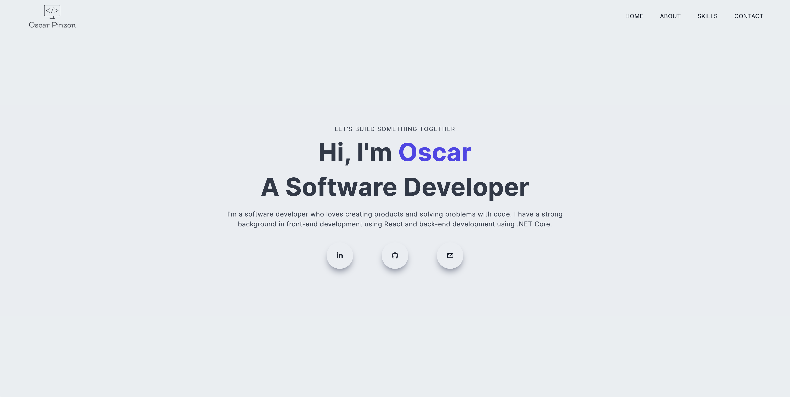

# Oscar Pinzon's Personal Portfolio

## Overview

This repository contains the source code for my personal portfolio, which showcases my projects, blog posts, and a brief introduction about myself. The portfolio is built using Next.js, a React-based framework, reflecting my skills and journey as a developer.



## Installation

To set up the project locally, follow these steps:

1. Clone the repository:
```bash
git clone https://github.com/oscarpinzon/portfolio_next_js.git
cd portfolio_next_js
```

2. Install the dependencies:
```bash
npm install
```

3. Start the development server:
```bash
npm run dev
```

Now you should be able to access the project at localhost:3000.

## Usage

Feel free to fork the repository, explore the code, and use it as inspiration for your own projects!

## Contributing

Contributions are welcomed! Here's how you can contribute:

1. Fork the repository.
2. Create a new branch (`git checkout -b new-feature`)
3. Commit your changes (`git commit -m 'Add some feature'`)
4. Push to the branch (`git push origin new-feature`)
5. Open a Pull Request.

## License

This project is licensed under the MIT License. See the `LICENSE` file for more information.

## Contact

- Email: [oscar.eugenio.pinzon@gmail.com](mailto:oscar.eugenio.pinzon@gmail.com)
- Location: Kitchener, Ontario, Canada

## Online Presence

- [Github](http://github.com/oscarpinzon)
- [LinkedIn](http://linkedin.com/in/oscareugeniopinzon)
- [Portfolio](http://oscarpinzon.com/)